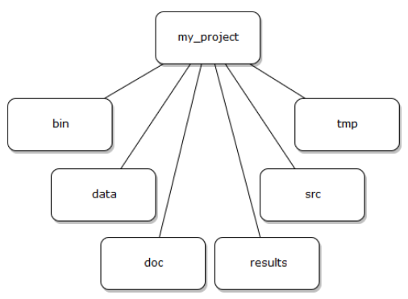

# Getting your project started

Project organization is one of the most important parts of a sequencing project, but is often overlooked in the
excitement to get a first look at new data. While it's best to get yourself organized before you begin analysis,
it's never too late to start.  

You should approach your sequencing project in a very similar way to how you do a biological experiment, and 
ideally, begins with experimental design. We're going to assume that you've already designed a beautiful 
sequencing experiment to address your biological question, collected appropriate samples, and that you have 
enough statistical power to answer the questions you're interested in asking.
For all of those steps, collecting specimens, extracting DNA, prepping your samples,
you've likely kept a lab notebook that details how and why you did each step, but documentation doesn't stop at the sequencer!  

Every computational analysis you do is going to spawn many files, and inevitability, you'll 
want to run some of those analysis again. Genomics projects can quickly accumulate hundreds of files across 
tens of folders. Do you remember what PCR conditions you used to create your sequencing library? Probably not.
Similarly, you probably won't remember whether your best alignment results were in Analysis1, AnalysisRedone, 
or AnalysisRedone2; or which quality cutoff you used.  

Luckily, recording your computational experiments is even easier than recording lab data. Copy/Paste will become
your best friend, sensible file names will make your analysis understandable by you and your collaborators, and 
writing the methods section for your next paper will be easy! Let's look at the best practices for 
documenting your genomics project.   

Your future self will thank you.  


In this exercise we will setup a filesystem for the project we will be working on during this workshop. We will 
use shell commands, programs and tools, including: 
* ``mkdir``  
* ``history``  
* ``tail``  
* ``|``  
* ``nano``  
* ``>>``  

When you begin a new project, you will need to decide upon some organizational structure for the relevant directories. We will start by creating a directory that we can use for the rest of the workshop. First navigate to your home directory. Then confirm that you are in the correct directory using the `pwd` command.

~~~
$ cd
$ pwd
~~~
{: .bash}

You should see the output: 

~~~
/home/username  
~~~
{: .output}


> ## Tip  
> If you aren't in your home directory, the easiest way to get there is to enter the command `cd`, which
> always returns you to home.  
{: .callout}

Now that we know how to navigate around our directory structure,
we'll learn how to create new directories and files. We can make new
directories with the `mkdir` command.

> ## Exercise  
> Use the `mkdir` command to make a `project` directory. 
> 
> > ## Solution
> > 
> > $ mkdir project
> {: .solution}
{: .challenge}

Within a given project, consider using a top-level organization that is logical, with chronological organization at the next level, and logical organization below that. A sample project, called `my_project`, will have a data directory for storing fixed data sets, a results directory for tracking computational experiments performed on that data, a doc directory with one subdirectory per manuscript, and directories such as src for source code, tmp for temporary files and bin for compiled binaries or scripts, as illustrated in the figure below.



A cookie cutter (aka project template) is a quick way to setup a folder structure that follows one standard to organize a project. This helps with project management, reproducibility, sharing, and publishing your data, analysis, and results. 

We have already modified a cookie cutter script (forked from chendaniely, originally inspired (and modeled off) by: Noble WS 2009 A Quick Guide to Organizing Computational Biology Projects. PLoS Comput Biol 5 7: e1000424. doi:10.1371/journal.pcbi.1000424).

To run the script, type `cd` to go to your home directory, then type `bash setup_project_dir.sh project/` in the terminal.

The setup_project_dir.sh script creates the following folder structure:
Path_Provided
|- doc/           # directory for documentation, one subdirectory for manuscript
|
|- data/          # directory for storing fixed data sets
|
|- src/           # directory for any source code
|
|- bin/           # directory for any compiled binaries or scripts
|
|- tmp/            # directory for temporary files that don’t need to be stored long-term
|
|- results/       # directory for output for tracking computational experiments performed on data


A README containing a brief blurb is placed in each folder to remind you of what goes in each folder, and also the overall folder structure will be retained.

Use `ls -R` to verify that you have created these directories. 

~~~
$ ls -R project
~~~
{: .bash}

The `-R` option for `ls` stands for recursive. This option causes
`ls` to return the contents of each subdirectory within the directory
iteratively. 

# Organizing your files

Before begining any analysis, it's important to save a copy of your 
raw data. The raw data should never be changed. Regardless of how
sure you are that you want to carry out a particular data cleaning
step, there's always the chance that you'll change your mind later 
or that there will be an error in carrying out the data cleaning and
you'll need to go back a step in the process. Having a raw copy of 
your data that you never modify guarantees that you will always be
able to start over if something goes wrong with your analysis. When
starting any analysis, you can make a copy of your raw data file and
do your manipulations on that file, rather than the raw version.

You can store any results that are generated from your analysis in
the `results` folder. This guarantees that you won't confuse results
files and data files in six months or two years when you are looking
back through your files in preparation for publishing your study.


# Documenting your activity on the project

When carrying out wet-lab analyses, most scientists work from a 
written protocol and keep a hard copy of written notes in their lab
notebook, including any deviations from the protocol. This detailed
record keeping process is just as important when doing computational
analyses. Luckily, it's even easier to record the steps you've 
carried out computational than it is when working at the bench.

The `history` command is a convenient way to document all the
commands you have used while analyzing and manipulating your project
files. Let's document the work we have done on our project so far. 

View the commands that you have used so far during this session using `history`:

~~~
$ history
~~~
{: .bash}

The history likely contains many more commands that you have used just for these projects. Let's view the last
several commands so that we focus only on what we need for this project.   

View the last **n** lines of your history (where n = approximately the last few lines you think relevant - for our example we will use the last 7:  

~~~   
$ history | tail -n 7
~~~

Do you remember what the `|` command does? 

The `pipe` sends the output of the first command (`history`) as input to the
next command (`tail`). We have used the `-n` option to give the last
7 lines of our history.  

Using your knowledge of the shell, use the append redirect `>>` to create a file called
**dc_workshop_log_XXXX_XX_XX.txt** (Use the four-digit year, two-digit month, and two digit day, e.g.
dc_workshop_log_2017_10_24.txt)  

You may have noticed that your history may contain the `history` command itself. To remove this redundancy
from our log, lets use the `nano` text editor to fix the file:  

```bash
    $ nano dc_workshop_log_xxxx_xx_xx.txt
```

From the nano screen, you should be able to use your cursor to navigate, type, and delete any redundant lines.   

Add a dateline and comment to the line where you have created the directory, for example:   

```bash
# 2017_10_24   
# Created sample directories for the Data Carpentry workshop  
```

Next, remove any lines of the history that are not relevant by navigating to those lines and using your 
delete key.   

Close nano by hitting 'Control' and the 'X' key at the same time; notice in nano this is abbreviated '\^X'.
Nano will ask if you want to save. Type 'Y' for yes. When prompted for the 'File Name to Write', hit 'Enter'
to keep the same name and save.   

Now that you have created the file, move the file to 'dc_workshop/docs' using the `mv` command.  


> ## Questions  
> 1. What is the default number of lines that tail displays?  
> 2. What is the difference between `>` and `>>`?
{: .challenge}

## References
[A Quick Guide to Organizing Computational Biology Projects](http://journals.plos.org/ploscompbiol/article?id=10.1371/journal.pcbi.1000424)


